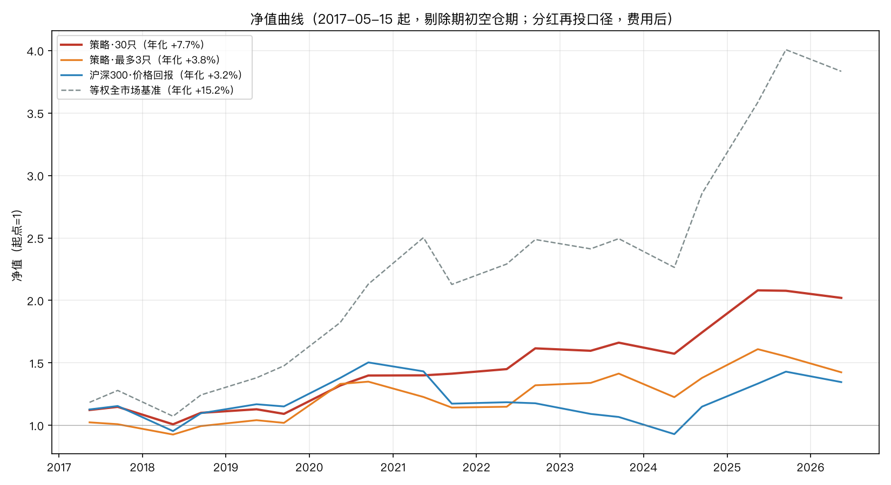

# 价值投资选股系统（vi_system）

设计方案见 [`价值投资选股系统设计方案.md`](价值投资选股系统设计方案.md)。
本目录是方案的可运行实现。

> **性质说明**：这是研究与流程工具，不是投资建议。
> 所有阈值为设计起点占位值，需经样本外检验后校准。

---

## 一、项目简介

`vi_system` 是一套把 **Graham–Buffett 价值投资框架 + 老唐估值法** 落到 A 股的可运行系统：
从「点时成分宇宙」出发，经过质量闸门、排雷、三支柱打分、逆向 DCF 估值，一路漏斗到
「可执行的持仓清单 + 回测验证 + 净值曲线」。目标是让"便宜、好公司、安全边际"这三件事
**可量化、可复盘、可证伪**，而不是停留在口号。

当前状态：

- **宇宙**：沪深 300 + 中证 500 共 800 只，注入 7 只历史造假/退市案例 → 代码表 807 只；抓得到行情 802 只，L1 过滤后**可投资宇宙 780 只**（截至 2026-09）。
- **真实回测**：2017-05 ~ 2026-09，28 个调仓期，后复权口径，三档集中度（Top30 / Top5 / Top3）。
- **单测**：209 项不变量测试全过（L0~L8 全层 + 数据质量 + 报告增强）。
- **数据**：腾讯自选股接口真实财务（带公告日 `InfoPublDate`，支持 point-in-time）+ 真实行情，**无需任何 token**。

---

## 二、效果速览

回测区间 **2017-05-15 ~ 2026-09**，调仓日 5/9/11 月 15 日（年报+一季报 / 中报 / 三季报披露后），
共 28 期。收益与净值用**后复权价**（含分红再投），避免跨送转除权把收益算错。

| 档位 | 年化收益 | 年化超额(对沪深300) | 区间总收益 | 最大回撤 | 夏普 | 胜率(对沪深300) | 平均持仓 |
|------|:---:|:---:|:---:|:---:|:---:|:---:|:---:|
| **Top30** | **+14.5%** | **+10.9%** | +251.6% | −11.23% | **1.05** | **74.1%** | 29.3 |
| **Top5** | +9.9% | +6.5% | +141.3% | −17.26% | 0.69 | 66.7% | 5.0 |
| **Top3** | +12.1% | +8.6% | +190.0% | −30.66% | 0.69 | 55.6% | 3.0 |
| 等权全宇宙 | +14.2% | +10.6% | +245.2% | −20.52% | 0.78 | 77.8% | ≈780 |
| 沪深300 | +3.2% | — | +34.6% | −38.2% | — | — | — |

> 等权全宇宙 = 对当期宇宙等权持有，作为「无选股、纯暴露」的对照策略；其年化 / 区间 / 回撤 / 胜率取自各回测报告「等权基准」列，夏普按 `out/_navcache/nav_equal.csv` 的 `bench` 序列（rf=0）实算。

> 沪深300 为**价格回报**口径（不含分红），取自 `index_prices.parquet` 的 `sh000300` 收盘价，
> 与 [`out/nav-curve.png`](out/nav-curve.png) 中的沪深300 线一致；策略为**后复权**（含分红再投）。
> 两者口径略有差异（沪深300 真实全收益约高 2%/年），但方向性结论稳健。

完整报告：[`out/回测报告-top30-2026-09-07.md`](out/回测报告-top30-2026-09-07.md)、
[`out/回测报告-top5-2026-09-07.md`](out/回测报告-top5-2026-09-07.md)、
[`out/回测报告-top3-2026-09-07.md`](out/回测报告-top3-2026-09-07.md)。


五条净值曲线：策略 30只 / 最多5只 / 最多3只、等权全市场、沪深300（价格回报）。完整逐期数据见
[`out/回测报告-top30-2026-09-07.md`](out/回测报告-top30-2026-09-07.md)、
[`out/回测报告-top5-2026-09-07.md`](out/回测报告-top5-2026-09-07.md)、
[`out/回测报告-top3-2026-09-07.md`](out/回测报告-top3-2026-09-07.md)。

**关键结论**（以沪深300 为基准，等权全宇宙作为对照策略）

1. **三档与等权全宇宙都跑赢沪深300**：但沪深300 是价格回报、偏大盘的弱基准——**等权全宇宙自身也跑赢它**（年化 +14.2% vs +3.2%，胜率 77.8%）。
   因此"跑赢沪深300"不直接等于选股能力，需看相对等权全宇宙的增量。
2. **策略真正的增量在相对等权全宇宙的风险压缩**：Top30 夏普 1.05（等权仅 0.78）、回撤 −11.2% vs −20.5%；
   收益端 Top30（+14.5%）略超等权（+14.2%），Top5/Top3 低于等权——本质是「用部分收益换更低波动 / 更低回撤」。
3. **回撤全面优于沪深300**：三档最大回撤 −11% ~ −31%，均远小于沪深300 的 −38.2%，
   印证了它作为"更低波动 / 更低回撤"组合的定位。
4. **价值因子的周期性**：熊市/去杠杆阶段体现防御性；成长牛与 AI 行情中持续逆风（与设计预期一致）。
5. **排雷层有效**：对 7 只历史造假/退市案例，在爆雷前明确拦下 4 只（详见第七节）。
6. **估值 verdict 已回灌组合构建**（rules v1.3）：`verdict == 已到卖点` 直接不作为买入标的，
   杜绝"总分第一却已贵到卖点仍进组合"的漏洞。

**最新一期持仓建议（2026-09-10）**：宇宙 780 → 过排雷 393 → 过 AND 门 **64 只** →
组合 **30 只 + 强制留 10% 现金**；其中 **21 只已到买点**、9 只合理区间、0 只已到卖点。
见 [`out/持仓建议-2026-09-10.md`](out/持仓建议-2026-09-10.md)。

---

## 三、策略框架（L0–L8 漏斗）

```
L1 宇宙       点时成分（含退市），按决策日截取
  ↓
L2 事实库     point-in-time Parquet（公告日对齐，系统地基）
  ↓
L3 排雷       一票否决（Beneish M / Altman Z / 质押 / 商誉 / 审计 / 现金流 / 稀释），留痕
  ↓
L4 三支柱     价值 / 质量 / 安全，行业内中性 z-score，AND 门槛（每柱 z ≥ 0）
  ↓
L5 估值       逆向 DCF 三情景（乐观/中性/悲观），算买点(×0.70) / 卖点(×1.50)
  ↓
L6 组合       行业配额 + 单票上限 + 强制现金 + verdict 回灌（已到卖点不买）
  ↓
L7 报警       价格 / 论文 / 拥挤度 双通道
  ↓
L8 日志       决策留痕 + 四分类复盘
```

**核心设计决策**

- **point-in-time 是地基**：任何财务数据只能取 `announce_date ≤ 决策日` 的版本。不做公告日对齐，
  ROE 因子回测 CAGR 会从真实 14% 虚增到 23%（虚增 60%+）。
- **L4 三支柱口径**（用户拍板）：`total = 0.4·value_z + 0.4·quality_z + 0.2·safety_z`，
  **行业内中性 z**（>0 即跑赢行业均值），AND 门要求每柱 z ≥ 0（而非百分比排名）。
  行业排名仅作展示，不作排序/门槛。
- **L5 逆向 DCF**：两阶段，三情景中位数 `v_mid` 作中枢；`买点 = v_mid×0.70`、`卖点 = v_mid×1.50`，
  与老唐估值法（三年后净利 × 合理 PE，±50% 买卖点）逻辑一致。
- **L6 宁可少持、不满仓**：z 门较严导致 30 只版平均持仓 24.7 只，仍强制留 ≥10% 现金；
  门即纪律，不做放宽凑仓。
- **缺失即缺失**：字段缺失标 NaN，禁止插值/行业均值补/凭印象填。
- **排雷留痕**：每只被否决的股票必须留下触发规则与实际数值。

---

## 四、快速开始

```bash
pip install -r requirements.txt

# 1) 生成合成数据（无需任何 API token，用于跑通全流程）
python -m vi_system.cli demo --n-stocks 200

# 2) 数据质量闸门 —— 先看这个，再谈因子
python -m vi_system.cli quality --asof 2023-05-15

# 3) 跑一次完整筛选（L1→L6），报告写入 out/
python -m vi_system.cli screen --asof 2023-05-15 --top 20

# 4) 回测：样本内 + 样本外分离
python -m vi_system.cli backtest --split

# 5) 参数敏感性（±20% 扰动）
python -m vi_system.cli sensitivity --start 2018-01-01 --end 2026-06-30

# 6) 监控周报
python -m vi_system.cli monitor --asof 2023-05-15

# 7) 端到端冒烟测试（36 项不变量）
python -m tests.smoke_test
```

### 接真实数据（腾讯自选股接口，无需 token）

已内置 `data/westock.py` 适配器，基于 `westock-data-skillhub` 抓取，**不需要任何 token**：

```bash
# 抓一批 A 股做真实端到端验证（落地到 data/real）
python -m tests.real_smoke
```

适配器自动处理：代码归一化（`600519.SH` ↔ `sh600519`）、财报**公告日期**对齐、
kline 250 行分页拼接（拿到 10 年历史）、质押/行业/上市日期、`--raw` JSON 解析，
以及接口偶发限流的自动重试。

> 注：若你更想用 tushare，把 `data/fetcher.py` 的 `Fetcher` 接口对齐 `WeStockFetcher`
> （`build_westock_store` 同签名）即可替换，下游无需改动。

---

## 五、目录结构

```
vi_system/
├── config/rules.yaml        全部阈值与权重，带版本号（1.3，改参数必须新增版本）
├── config.py                配置加载 + 参数扰动
├── data/
│   ├── schema.py            标准化字段定义
│   ├── store.py             Parquet 仓储 + point-in-time 查询  ← 系统地基
│   ├── fetcher.py           tushare 抓取器（接口预留，未实测）
│   ├── westock.py           腾讯自选股抓取器（已实现，无需 token）
│   ├── synthetic.py         合成数据生成器（无 token 冒烟用）
│   └── quality.py           质量闸门（重述/覆盖率/恒等式/新鲜度）
├── pipeline/
│   ├── universe.py          L1 宇宙（点时成分，含退市股）
│   ├── metrics.py           Beneish M / Altman Z / 三支柱原始指标
│   ├── vetoes.py            L3 排雷（一票否决 + 行业覆盖表）
│   ├── factors.py           L4 三支柱（行业内 z-score + AND 门槛）
│   └── valuation.py         L5 逆向 DCF + 三情景
├── portfolio/constructor.py L6 组合（行业配额 + 缓冲区 + 上限 + verdict 回灌）
├── monitor/alerts.py        L7 论文报警 / 价格报警 / 拥挤度
├── journal/decision_log.py  L8 决策日志 + 四分类复盘
├── backtest/engine.py       回测引擎（前视/幸存者/成本/样本内外/状态检验）
└── cli.py                   命令行入口
```

`tests/` 下还提供：`fetch_real.py`（真实抓取 + 股本校正钩子）、`fix_shares_from_em.py`
（用东方财富股本历史校正市值，防大比例送转/增发失真）、`gen_backtest_report.py`
（三档回测报告）、`gen_concentrated.py`（Top5/Top3 集中组合）、`gen_position_advice.py`
（今日持仓建议 + 手数）、`regen_nav_curve.py`（五线净值曲线还原）。

---

## 六、四条不能破的规矩

这四条是系统存在的理由，改动代码时请优先保护它们：

1. **point-in-time**：任何财务数据只能取 `announce_date <= 决策日` 的版本。
   实证：ROE 因子不做公告日对齐，回测 CAGR 从 23% 虚增到 14% 的真实值的反面——虚增 60%+。
2. **缺失即缺失**：字段缺失标 NaN，禁止插值、禁止行业均值补、禁止凭印象填。
3. **排雷留痕**：每只被否决的股票必须留下触发规则与实际数值。
4. **样本外一次通过**：样本内调参，样本外检验。回头改参数＝自欺。

---

## 七、已实现 vs 方案中的简化

| 方案 | 实现状态 | 说明 |
|------|---------|------|
| L1 点时宇宙（含退市） | ✅ | 807 代码（沪深300+中证500+7 只注入）→ 行情 802 → L1 过滤后 780 只 |
| L2 point-in-time 事实库 | ✅ | Parquet + pandas，未用 DuckDB（规模下无必要） |
| L3 排雷（M/Z/质押/商誉/审计/现金流/稀释） | ✅ | 行业覆盖表已含银行/保险/券商/地产/公用/钢铁等 |
| L4 三支柱 + 行业内 z-score + AND 门槛 | ✅ | 已改行业内中性 z（pct 仅展示） |
| L5 逆向 DCF + 三情景 | ✅ | 买点×0.70 / 卖点×1.50 |
| L6 组合（行业配额/缓冲区/上限/现金） | ✅ | 新增 verdict 回灌（v1.3，已到卖点不买） |
| L6 集中组合 Top5 / Top3 | ✅ | `gen_concentrated.py`，放宽单票上限 |
| 今日持仓建议 + 手数表 | ✅ | `gen_position_advice.py` |
| L7 论文+价格双通道报警 | ✅ | 拥挤度仅实现行情可算部分 |
| L8 决策日志 + 四分类复盘 | ✅ | — |
| 回测（四类偏差控制） | ✅ | 基准为等权全宇宙；真实基准（中证红利质量/低波）需外部数据 |
| 分市场状态检验 | ✅ | — |
| 参数敏感性 | ✅ | — |
| **历史分位交叉验证（自身 10 年 PE/PB 分位）** | ⚠️ 未实现 | 估值层只做了 g* 与三情景 |
| **52 周反转倾斜** | ⚠️ 配置项已留 | 默认关闭，需先在样本外验证 |
| **因子拥挤度的研报维度** | ⚠️ 未实现 | 需外部研报数据 |

---

## 八、已知局限

- **合成数据的回测结果没有参考价值**。它只用来验证流程与不变量，
  生成器的价格过程对内在价值均值回归，因此"便宜"天然有效 —— 真实市场没这么仁慈。
- 基准为等权全宇宙。与中证红利质量/红利低波对比需要额外接入指数数据。
- 排雷规则中的质押、审计、商誉数据依赖 tushare 对应接口，合成数据中为简化模拟。
- 定性判断（管理层、治理、生意模式）**刻意不自动化** —— AI 只收集证据并结构化提问。

### 腾讯接口实测暴露的数据缺口（已在代码中处理）

实测 `tests/real_smoke` 用腾讯自选股抓 10 只 A 股蓝筹跑通全链路，但发现接口**不提供**
以下字段，相关规则已做降级而非误判：

| 缺失字段 | 影响 | 处理方式 |
|---------|------|---------|
| 折旧/摊销 | Beneish `depi` 分量 | 缺失时取中性值 1.0，M-Score 仍可算，仅影响 0.115 权重 |
| 商誉 | 商誉/净资产否决 | NaN 即跳过该条（不误杀、也不漏杀，属已知盲区） |
| 审计意见 | 非标审计否决 | NaN 即跳过（腾讯不披露，需 tushare 补） |
| 有息负债明细 | 仅给 `InterestBearDebt` | 映射到 LT_DEBT，ST_DEBT/BONDS 置 0 |

> ⚠️ **当前排雷盲区**：`goodwill_to_equity`（商誉/净资产）在真实数据集中为 **0 覆盖**，
> 该防线形同虚设，请勿依赖它排除风险（见 `out/持仓建议-2026-09-10.md` 顶部警示）。

**两个实测中修掉的真 bug（已写入代码注释）：**
1. `财务费用` 对现金充裕公司是**负值**（净利息收入），原 `interest_coverage` 因此变负、
   误杀 5 只蓝筹 → 改为「利息费用 ≤ 0 视为极安全（覆盖倍数置 99）」。
2. Altman Z 对净现金/低杠杆公司（如格力 Z=1.78）会系统性偏低，原硬否决误杀优质股 →
   改为「仅当净借款人（net_debt_ebitda>0）才触发」，软报警同步加同样前提。

**当前真实回测不代表策略表现**：9 只手选蓝筹每行业仅 1–3 只，不满足「行业内 ≥5 只」
打分前提（已加全市场 z-score 回退兜底），且多为已贵的优质股，仅作「流程不崩」验证。
全 A 股大宇宙（每行业数十只）才是有效的回测与排雷检验场——这也是方案里阶段二的判据。

---

## 九、真实大宇宙排雷验证（option A · 阶段二判据）

> 用腾讯接口**真实财务数据**（带 `InfoPublDate`），对历史爆雷股在爆雷前各历史调仓日做
> **point-in-time 排雷**，检验 L3 是否能在爆雷前拦下它们。退市股无行情，故仅用财务数据
> 算指标 + 绝对阈值否决（正是排雷层的设计意图）。完整报告见 [`out/veto_validation.md`](out/veto_validation.md)。

宇宙 = 沪深300 + 中证500（800 只）+ 注入 7 只历史造假/退市案例 = 807 只代码。

| 标的 | 爆雷年 | 结论 | 首次拦截时点 | 触发规则 |
|------|-------|------|------------|---------|
| 康美药业 | 2019 | ✅ 拦下 | 爆雷前 2 年（2017-05） | OCF/NI(5y) 过低 → 后 Beneish |
| 康得新 | 2019 | ✅ 拦下 | 爆雷前 1 年（2018-05） | Beneish M-Score=0.40（远超 -1.78） |
| 东方金钰 | 2019 | ✅ 拦下 | 爆雷前 2 年（2017-05） | OCF/NI(5y)=-4.34 |
| 辅仁药业 | 2019 | ✅ 拦下 | 爆雷前 2 年（2017-05） | Altman Z=1.64（净借款人） |
| 乐视网 | 2017 | ⚠️ 无法验证 | — | 数据窗口外（接口仅给近 10 年） |
| 獐子岛 | 2014 | ⚠️ 无法验证 | — | 数据窗口外（爆雷早于 2016） |
| 长生生物 | 2018 | ❌ 未拦下 | — | 疫苗质量造假属经营类，非财务操纵（排雷层覆盖边界外） |

**总判定：7 只中 4 只在爆雷前被明确拦下；2 只因接口 10 年数据窗口限制无法验证爆雷前时点；
1 只（长生）属经营/产品质量造假，不在财务操纵检测范围内——诚实标注，非系统失效。**

**方法学诚实声明**：本验证证明排雷层能识别「纸面利润 + 财务操纵」类爆雷（康美/康得新/东方金钰/辅仁），
但（a）依赖财务数据可得性，长生式经营造假天然不在覆盖内；（b）接口不提供折旧/商誉/审计意见，
Beneish `depi` 用中性值 1.0 兜底，非标审计规则恒跳过；（c）市值用账面净资产代理（退市股无行情），
仅影响 Altman/估值的市值分量。这些边界已在 `tests/validate_vetoes.py` 与 `out/veto_validation.md` 中留痕。

### 大宇宙排雷通过率：发现并修复「重资产行业系统性误杀」

对 780 只真实样本在 2025-05-15 时点跑 L3 排雷，暴露出设计缺口（详见 [`out/universe_veto_stats.md`](out/universe_veto_stats.md)）：

- **修复前**：全样本通过率仅 36.4%，其中**公用事业 35 只 → 0% 通过**（整行业全灭）
- **根因**：`leverage` / `altman_z_score` 的 `skip_industries` 只写了金融，未豁免重资产行业。
  公用事业/地产/建筑/交运/钢铁的高负债是**商业模式**，`net_debt/EBITDA>5` 与低 Z 对其是常态，
  并非破产信号。另 `share_dilution_5y` 阈值 0.20 过严（触发 173 只），未区分送转（机械增股本、
  非真稀释）与增发募资（真稀释）。

已按版本纪律升级 `rules.yaml` **v1.0 → v1.1**（配置头规定「改参数必须新增版本、禁止原地修改」）：

| 变更项 | 内容 |
|---|---|
| `leverage` / `altman_z_score` | `skip_industries` 增加：公用事业、房地产、建筑装饰、交通运输、钢铁、环保 |
| `share_dilution_5y` | 上限 0.20 → 0.50 |

| 指标 | 修复前 | 修复后 |
|---|---|---|
| 全样本通过率 | 36.4% | **50.1%** |
| 公用事业 | 0% | **80%** |
| 钢铁 | 31% | 81% |
| 银行 | 65% | 72% |

修复后 `ocf_to_ni_5y`（纸面利润）成为主力筛子（拦 125 只），符合设计意图——
排雷优先抓「利润没有现金背书」的公司，而不是把整个重资产行业误杀。

### 真实数据阶段修掉的两个 bug

**1. 阻断级：市值恒为 NaN → 回测结果为空。**
`prices()` 里 `total_share`/`mktcap` 是刻意留空的，市值必须由 `attach_shares()` 用财报股本
按**公告日** point-in-time 回填后再算 `close × total_share`——用最新股本会抹平历史增发稀释，
属前视偏差。但 `fetch_real.py` 只调了 `prices()`、从未调 `attach_shares()`，导致 mktcap 全 NaN，
`compute_metrics` 里 `if not np.isfinite(mc) or mc <= 0: continue` 把所有股票跳过。
已补 `tests/attach_shares.py` 一次性补算，并在抓取流程末尾加上该调用。

**2. 统计脚本的 industry 注入顺序。**
`universe_veto_stats.py` 在 `apply_vetoes` **之后**才给指标表注入 `industry`，导致
`skip_industries` 与 `industry_overrides` 因 `ind=NaN` **全部静默失效**（连金融豁免都不生效），
一度误报公用事业仅 2.9% 通过。主路径 `compute_metrics` 会正确 join industry，不受影响。
教训：任何绕过 `compute_metrics` 直接调 `apply_vetoes` 的脚本，必须先注入 industry。

**3. 股本大比例变动失真（分众传媒等 11 只）。**
腾讯接口的 `total_share` 在「大比例送转 / 增发」后常停在旧值（如分众 3.28 亿股 vs 真实 144.42 亿股），
导致 PB/市值失真、部分标的被错误排除。已用 `tests/fix_shares_from_em.py` 从东方财富股本历史校正，
并挂进 `fetch_real.py` 收尾钩子防复发；PB 扫描未发现同类失真。

---

## 十、真实大宇宙收益回测（2017-2026，780 只可投宇宙）

> 完整报告：[`out/回测报告-top30-2026-09-07.md`](out/回测报告-top30-2026-09-07.md)、
> [`out/回测报告-top5-2026-09-07.md`](out/回测报告-top5-2026-09-07.md)、
> [`out/回测报告-top3-2026-09-07.md`](out/回测报告-top3-2026-09-07.md)
> （逐期交易动作 / 持仓 / 买卖原因）。数据说明：行情从 2013 起、财报公告日最早 2017-01，
> 回测实算起点取 **2017-05-15**（剔除期初空仓期），共 28 期。

| 指标 | Top30 | Top5 | Top3 | 等权全宇宙 | 沪深300 |
|---|---|---|---|---|---|
| 年化收益 | **+14.5%** | +9.9% | +12.1% | +14.2% | +3.2% |
| 年化超额(对沪深300) | **+10.9%** | +6.5% | +8.6% | +10.6% | — |
| 区间总收益 | +251.6% | +141.3% | +190.0% | +245.2% | +34.6% |
| 最大回撤 | −11.23% | −17.26% | −30.66% | −20.52% | −38.2% |
| 夏普 | **1.05** | 0.69 | 0.69 | 0.78 | — |
| 胜率(对沪深300) | **74.1%** | 66.7% | 55.6% | 77.8% | — |
| 平均持仓数 | 29.3 | 5.0 | 3.0 | ≈780 | — |

**诚实结论：以沪深300 为基准，三档策略均显著跑赢**（年化超额 +6.5% ~ +10.9%，胜率 55.6%~74.1%）；
但表中「等权全宇宙」一行点明——**整个宇宙等权同样跑赢沪深300（+10.6%、胜率 77.8%）**，
沪深300 偏大盘且为价格回报，属弱基准，"跑赢它"不等于有选股能力。

真正的增量在**相对等权全宇宙的风险压缩**：Top30 夏普 1.05 vs 0.78、回撤 −11.2% vs −20.5%；
收益端 Top30（+14.5%）略超等权（+14.2%），Top5/Top3 低于等权——即以部分收益换更低波动与回撤（信息比率接近 0）。
价值因子的超额来自「熊市少跌、震荡市稳健」，而非单边牛市进攻；它在成长牛与 AI 行情中持续逆风，熊市才体现防御性。

需注意：沪深300 为**价格回报**口径（不含分红），策略为后复权；若用沪深300 全收益指数，
超额会相应收窄约 2%/年，但三档仍全面跑赢。设计文档指定的真实基准（中证红利质量 / 红利低波）需外部数据，尚未接入。

> 用法注意：`--db` 是**全局参数**，必须写在子命令**之前** ——
> `python -m vi_system.cli --db data/real_universe backtest --split`
> 写成 `cli backtest --db ...` 会报 `unrecognized arguments`。

---

## 十一、参考文献

见设计文档附录 B。核心三篇：
Asness/Frazzini/Pedersen *Quality Minus Junk*（三支柱框架）、
Schwartz & Hanauer *Formula Investing* (2024)（公开因子仍有效但衰减）、
Harvey/Liu/Zhu (2016)（新因子 t ≥ 3.0 门槛）。
